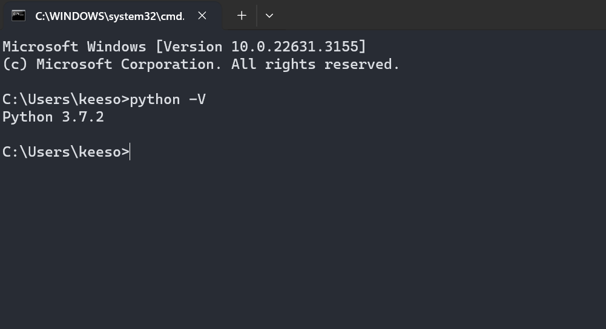
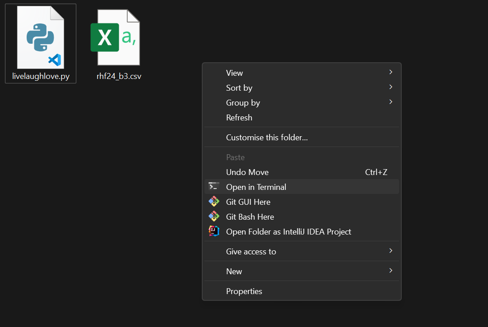
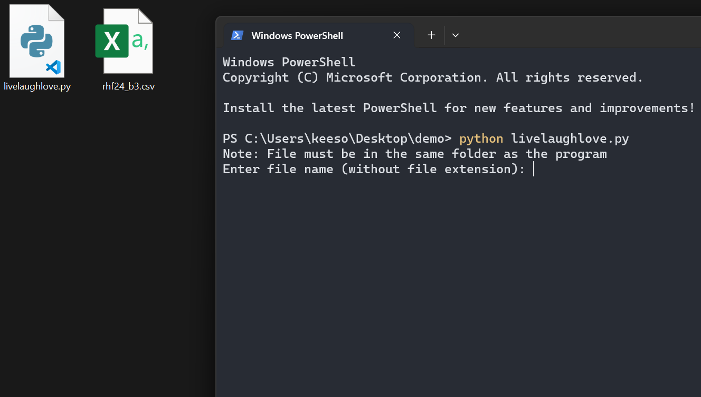

# Exportify Parser

This program was created for RH Unplugged and RHockerfellas to streamline the process of exporting songs from Spotify playlists.

Found a bug? Report it to @s0ngyang on Telegram.

Have any suggestions? Feel free to contribute by creating a PR :)

## Pre-requisite

Have the latest version of [Python] installed.

[python]: https://www.python.org/downloads/

How to check if you have Python?

1. Open terminal (For windows, Win+R -> Type "cmd" and enter)
2. Enter the command `python -V`

The screen if you have python installed (version may differ), otherwise please download from above.

## Usage

1. Download livelaughlove.py directly
2. Move the csv file and livelaughlove.py into the same folder.
3. Open terminal from the folder.
   
4. Enter the command `python livelaughlove.py`
   
5. Enter the csv file name e.g. `rhf24_b3`
   
6. Copy the output from the terminal, or open `output.txt` and Ctrl+A then Ctrl+C.
7. Paste into the band chat and you're done!
